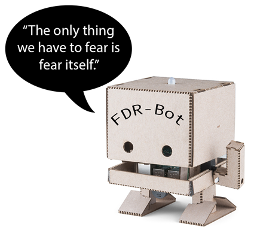

# History Bot 1.0

A History Bot is a device that responds to user interaction with a visual, mechanical or aural response based on a historical setting, figure or concept.
The History Bot 1.0 is built using a Raspberry Pi 3B+.

The History Bot provided here will play an audio file in response to a button press. This repository also includes an example History Bot that will read out a text file, and another that reads out a text file on a Raspberry Pi with an attached speaker and no additional hardware.

This project is offered as a suggestion to fellow educators who are interested in bringing a project like this into student-focused coursework.
I work as an historian looking to bring technological skills and interactions with technology into the classroom. 
More information on the History Bot 1.0, including a recap of my own experiences teaching a class using this project, can be found on [my website](http://www.profjohnharney.com).

I have endeavoured to be clear in laying out the basic steps involved in creating a History Bot, but independent research is often inevitable.
If you succeed in creating this History Bot you will learn plenty along the way, and will have the tools to start making your own projects if you choose.

I hope this is helpful! Comments are welcome. You can read more about me [here](http://www.profjohnharney.com) and you can contact me on twitter at [@profjohnharney](http://www.twitter.com/profjohnharney).

## Some brief information

### What you need to make the History Bot
- a Raspberry Pi (I have used a Zero and a 3B+)
- a power supply
- an SD card (8GB is more than enough, and you can redeploy for other projects)
- an interactive button
- a speaker (this project uses a USB speaker)
- an led and an appropriate resistor
- connectors, such as jumper wires and alligator clips
- some kind of housing for the bot; this project used a 3D printer to fabricate IBM's [TJ Bot](https://ibmtjbot.github.io/) design

### My goals in teaching the History Bot
- to encourage students to be creative in their research of and presentation of historical topics
- to give students experience and practice in working with others in a small group
- to introduce students to practical use of coding, without the need for prior experience

### I have no experience in coding, can I do this?
YES, though you want to give yourself some lead time to work through some basic programming ideas and hardware scenarios.
If you have never done anything like this before, be prepared for what seem like minor tasks sometimes taking a while to complete, especially if you are teaching or working on other projects.

However, the feeling you get when you solve a problem, or learn a new skill?
I have rarely had so much fun doing my job.
And I love my job.
